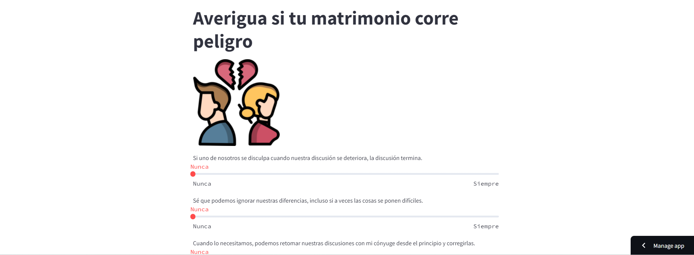

# Aplicación divorce
Esta aplicación hecha en Streamlit con Machine Learning integrado predice si tu matrimonio corre peligro o por el contrario es estable.

[URL página](https://divorceweb.streamlit.app/)

## Obtención de datos
El dataset del modelo lo he obtenido del siguiente enlace de [Kaggle](https://www.kaggle.com/datasets/andrewmvd/divorce-prediction).

## Contenido
El cuestionario dispone de 25 preguntas relacionadas con el matrimonio, las cuales se pueden contestar en una escala de 5 puntos: 
*   Nunca
*   Rara vez
*   Promedio
*   Con frecuencia
*   Siempre

Dependiendo de las respuestas, se pueden obener dos resultados: 
1. Tu relación parece estar enfrentando desafíos. 😣
2. Tu relación está en una fase estable. ¡Seguid así! 😊

